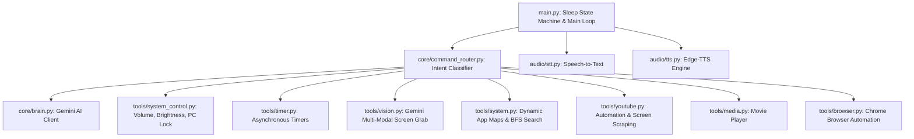

# 🤖 F.R.I.D.A.Y. Voice Assistant (v2.0)

[](https://www.python.org/)
[](https://opensource.org/licenses/MIT)

F.R.I.D.A.Y. (Female Replacement Intelligent Digital Assistant Youth) is a highly optimized, fully modular voice-activated desktop agent inspired by Tony Stark's legendary AI from *Iron Man*. Friday is engineered to run in the background, offering high-fidelity conversation, hardware system automation, screen vision capabilities, asynchronous background timers, and seamless integration with your local files and websites.

---

## ⚡ Key Capabilities

### 👁️ 1. Multi-Modal Screen Vision
Friday can literally "see" what is on your computer screen. She takes a silent screenshot and feeds it directly to Google's multi-modal Gemini Flash model to give you real-time visual analysis.
- *"Friday, what is on my screen?"*
- *"Read the error message on my screen."*
- *"Explain what I am looking at."*

### 🔊 2. Hardware & Device Automation
Control physical components of your workstation seamlessly.
- **Volume**: *"Set volume to 50%"* or *"Mute volume"*. Includes a **bulletproof hardware-simulation fallback** for Bluetooth headsets and neckbands (like the CMF Neckband Pro) when traditional Windows COM controls fail.
- **Brightness**: *"Set brightness to 60%"*. Intelligently manages **multi-monitor setups**. If multiple displays are detected, she asks which display (laptop, external monitor, or both) to modify, or lets you specify it directly: *"set external monitor brightness to 80%"*.
- **System Security**: *"Lock my PC"* or *"Lock the computer"* to immediately secure your workstation.

### 👂 3. Instant Wake-On-Speech (Sleep State)
To protect system resources and reduce API requests, Friday enters a low-power **Sleep State** after 10 seconds of silence. 
- When asleep, she continues running in the background. 
- You don't have to call her name to wake her up! The moment she detects **any spoken command** (e.g. *"open YouTube"*), she immediately wakes up, plays a high-pitched activation chime `*BEEP*`, and executes your command instantly!

### 🔍 4. Ultra-Fast Search & File Interaction
Friday is equipped with an optimized **Breadth-First Search (BFS)** engine that scans your `D:\` and `E:\` drives up to 4 levels deep in milliseconds.
- *"Open my movies folder"* (locates and opens directories instantly via Windows File Explorer).
- *"Create a folder called Projects"* or *"Create a file named logs.txt"*.
- *"Play local movie Inception"* (automatically locates and plays media files using your system's default player).

### 💬 5. Native Desktop App & Web Protocol Routing
Friday handles applications and websites with intelligent priority:
- **Desktop-First**: When you say *"open WhatsApp"*, she uses native Windows protocols (`whatsapp:`) to launch the Microsoft Store/UWP Desktop Application first.
- **Web Fallback**: She only opens Google Chrome to web clients (like `web.whatsapp.com`) if the desktop app is not installed.
- **Smart Web Actions**: Opens any popular site (YouTube, GitHub, ChatGPT) or runs direct browser automation.

### ⏰ 6. Asynchronous Background Timers
Spawn non-blocking background threads to set precise timers. Friday will run them in the background while continuing to listen to and assist you. When the timer is up, she will interrupt to notify you verbally.
- *"Set a timer for 10 minutes."*

---

## 🏗️ Modular Architecture

Friday has transitioned from a monolithic script into a clean, modern, and highly modular architecture.



- **`audio/`**: Core input/output loops for high-speed speech-to-text recognition and natural, high-fidelity synthesis using Microsoft Edge TTS.
- **`core/`**: The brain of Friday. Features structural intent routing and connection to the Google GenAI SDK.
- **`tools/`**: Reusable plugin-style modules to execute local commands, automate physical devices, set background threads, and interact with web browers.

---

## 🔒 Security & Governance

Friday strictly adheres to local system security guidelines, defined in `system_rules.md`:
- **Strict Read-Only Exception**: Friday has **zero write or modify permissions** on the `C:\` drive.
- **Allowed Startup Paths**: She is only permitted read-only access to Windows Start Menu directories to dynamically index shortcuts (`.lnk` files) on startup, allowing you to launch any local application.

---

## 🚀 Setup & Installation

### Prerequisites
- Windows 10/11 Workstation
- Python 3.10 to 3.13 installed
- Google Gemini API Key

### Installation

1. **Clone the Repository:**
   ```bash
   git clone https://github.com/AbuBakar223200/Friday.git
   cd Friday
   ```

2. **Set Up a Virtual Environment:**
   ```bash
   python -m venv .venv
   .venv\Scripts\activate
   ```

3. **Install Dependencies:**
   ```bash
   pip install -r requirements.txt
   ```

4. **Configure Environment Variables:**
   Create a `.env` file in the root directory:
   ```env
   GEMINI_API_KEY=your_actual_gemini_api_key_here
   ```

5. **Launch Friday:**
   ```bash
   python main.py
   ```

---

## 🤖 Authentic Iron Man Interactions

Friday communicates exactly like Tony Stark's assistant:
- **Startup**: *"Friday is online. How can I help you today, Sir?"*
- **Wake Chime**: Active `*BEEP*` sound when waking up.
- **Shutdown**: *"Friday offline. Shutting down, Sir."*

---

## 📄 License
This project is licensed under the MIT License - see the [LICENSE](LICENSE) file for details.
