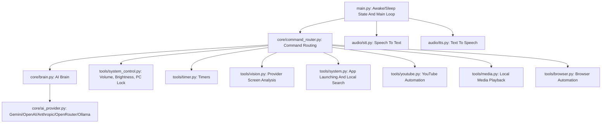

# Friday Voice Assistant

[](https://www.python.org/)
[](https://opensource.org/licenses/MIT)

Friday is a Windows-first voice assistant for CSE students. The MVP focuses on one high-value study workflow: helping a student understand visible coding errors, terminal failures, dependency issues, and project setup problems.

The first signature command is:

```text
Friday, debug my screen.
```

When asked, Friday captures the current screen, sends that screenshot to the configured AI provider for analysis, explains the likely problem in plain language, recommends a safe next step, and asks before taking action.

## CSE-Student MVP

Friday is designed first for students working in VS Code, terminals, browsers, and local project folders on Windows.

The intended debugging response is short enough to be spoken aloud:

```text
Problem: ...
Cause: ...
Fix: ...
Permission: Should I ...?
```

Example:

```text
Problem: Python cannot find the requests package.
Cause: Your active environment probably does not have requests installed.
Fix: Run pip install requests in the same environment you use to run this file.
Permission: Should I run that command for you?
```

## Key Capabilities

### 1. Debug My Screen

Friday can help explain visible programming problems after an explicit request.

- "Friday, debug my screen."
- "Friday, explain this error."
- "Friday, what is wrong with my code?"
- "Friday, help me debug."

This feature is meant for coding errors, terminal output, package installation failures, Git issues, path problems, runtime errors, and confusing project setup messages.

### 2. Screen Analysis

Friday can analyze what is visible on screen when asked.

- "Friday, what is on my screen?"
- "Friday, read the error message on my screen."
- "Friday, explain what I am looking at."

Screenshot analysis depends on visible, readable text. If the screenshot is unclear, Friday should say so and ask the student to zoom in, select the terminal, or read the error aloud.

### 3. Safe Permission Model

Friday follows this rule:

```text
See -> explain -> recommend -> ask permission -> act.
```

For the CSE-student MVP, the important promise is simple: Friday explains first and asks before running commands, editing files, installing packages, or changing the system.

Friday should never claim that it ran a command or changed a file unless that action actually happened after permission.

### 4. Hardware And Desktop Assistance

Friday includes local Windows assistant features such as:

- Volume controls.
- Brightness controls.
- PC lock commands.
- Background timers.
- App and website launching.
- Local file and folder lookup on allowed drives.

## Screenshot Privacy

Screen debugging captures your current screen only when you explicitly ask Friday to debug or analyze it. The screenshot is sent to the configured AI provider for analysis and is not saved by Friday.

Friday should not:

- Capture screenshots continuously in the background.
- Save screenshots to disk.
- Keep a screenshot history.
- Upload unrelated files as part of screen debugging.

Read more in [docs/privacy.md](docs/privacy.md).

## Command Examples

Common MVP commands are collected in [docs/command-examples.md](docs/command-examples.md).

## AI Providers

Friday can use Gemini, OpenAI, Anthropic, OpenRouter, or Ollama through `.env` settings. See [docs/ai-providers.md](docs/ai-providers.md).

## Modular Architecture

Friday is organized as a Python desktop assistant with separate modules for voice input, speech output, routing, AI provider calls, and tools.



## Security And Governance

Friday follows the restrictions documented in [system_rules.md](system_rules.md).

Important rules:

- Friday must not search, modify, or expose files on `C:\`, except for the documented read-only Start Menu access used to discover installed apps.
- Local OS file searches should be limited to `D:\` and `E:\`.
- Start Menu access is read-only and must not modify, delete, or write files.
- Any future command execution or file editing should be explicit, scoped, and permission-based.

## Setup And Installation

### Prerequisites

- Windows 10 or Windows 11.
- Python 3.10 to 3.13.
- At least one AI provider key, such as Gemini, OpenAI, Anthropic, OpenRouter, or a local Ollama model.
- Microphone access.

### Installation

1. Clone the repository:

   ```bash
   git clone https://github.com/AbuBakar223200/Friday.git
   cd Friday
   ```

2. Set up a virtual environment:

   ```bash
   python -m venv .venv
   .venv\Scripts\activate
   ```

3. Install dependencies:

   ```bash
   pip install -r requirements.txt
   ```

4. Configure environment variables by creating a `.env` file in the root directory. For Gemini-only use:

   ```env
   AI_PROVIDER=auto
   GEMINI_API_KEY=your_actual_gemini_api_key_here
   ```

   Friday also supports these provider options:

   ```env
   AI_PROVIDER=openai
   OPENAI_API_KEY=your_openai_key_here
   ```

   ```env
   AI_PROVIDER=anthropic
   ANTHROPIC_API_KEY=your_anthropic_key_here
   ```

   ```env
   AI_PROVIDER=openrouter
   OPENROUTER_API_KEY=your_openrouter_key_here
   ```

   ```env
   AI_PROVIDER=ollama
   OLLAMA_MODEL=llava
   ```

5. Launch Friday:

   ```bash
   python main.py
   ```

## Limitations

- Friday is currently Windows-first.
- AI-powered features require one configured provider key or local Ollama model.
- Screen debugging works best when the relevant error is visible and readable.
- The CSE-student MVP should explain and request permission before any command or edit.

## License

This project is licensed under the MIT License. See [LICENSE](LICENSE) for details.
